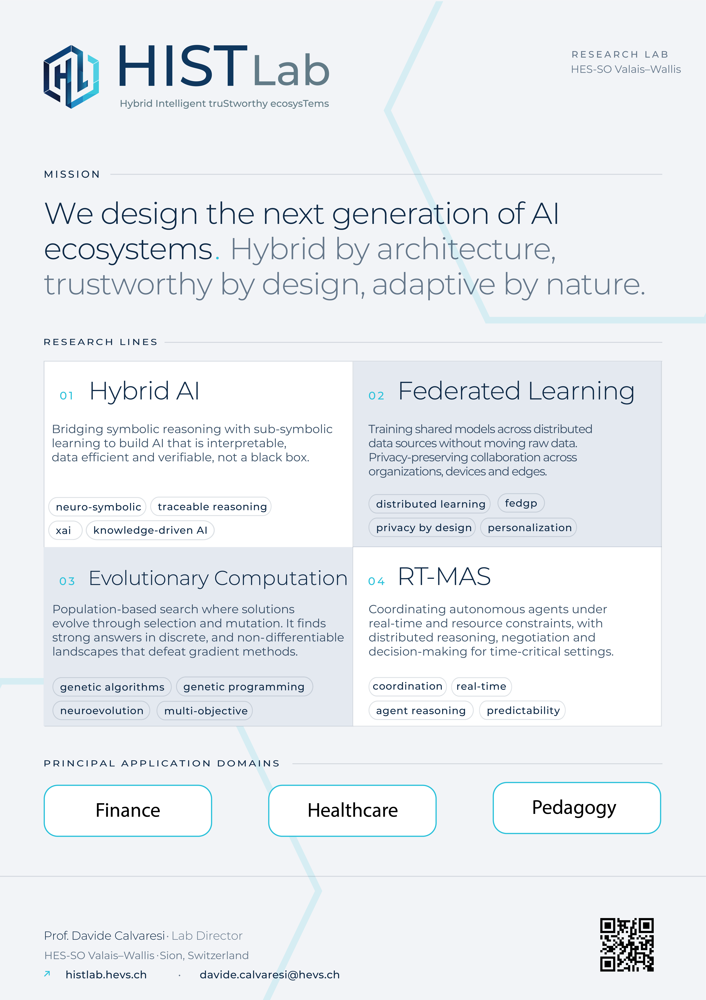

# HISTLab

  <strong>Hybrid Intelligent truStworthy ecosysTems</strong>

The HIST Lab focuses on hybrid and distributed intelligent systems operating in complex cross-disciplinary domains. The lab investigates how learning-based models, symbolic reasoning, autonomous agents, and human actors can be integrated to support reliable and transparent decision-making.

HIST Lab centers on trustworthy-by-design approaches, where explainability, governance, and accountability are treated as core system properties. Through both foundational and applied research, the lab contributes methods and frameworks for building intelligent ecosystems that remain understandable, controllable, and aligned with human requirements and values.

  

  <a href="https://histlab.hevs.ch">
    Visit the HIST Lab website
  </a>

